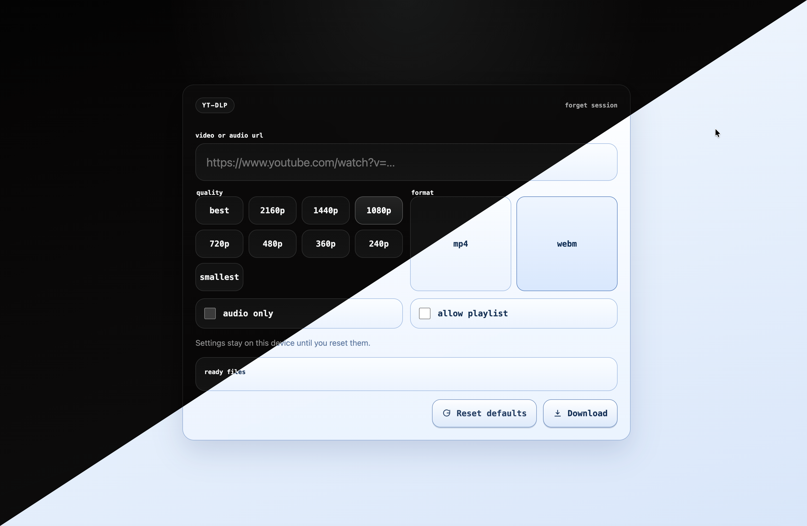

# yt-dlp web ui

Minimal single-page yt-dlp UI built with native Node.js APIs only. Downloads, remuxing, and H.264 conversion all run on the server with `yt-dlp` and `ffmpeg`.



## Features

- Single-page UI served by native `node:http`
- Saved download settings in `localStorage`
- Compact live download progress in the sticky action area
- Direct stream-link lookup for platforms where a raw media URL is more useful than a saved file
- Optional server-side video conversion to `remux mp4` or `h264 mp4`
- Short quality picker by default, with a toggle to reveal the full list

## Requirements

- Node.js 18+
- `yt-dlp` available on `PATH`
- `ffmpeg` available on `PATH` if you use `convert`

## Run

```sh
npm start
```

The app listens on the host and port defined in [`config.json`](./config.json).

## Password auth

Password auth is off by default.

To enable it:

1. Copy `.env.example` to `.env`.
2. Set `APP_PASSWORD`.
3. Set a long random `SESSION_SECRET`.
4. Change `auth.requirePassword` to `true` in [`config.json`](./config.json).
5. If you are serving the app over HTTPS, set `auth.secureCookies` to `true`.

The browser stores the session token in both a cookie and `localStorage`, so you only need to unlock once per device/session window.

## Rate limiting

Request throttling is disabled by default for personal use.

If you want it, tune the values in [`config.json`](./config.json):

- `rateLimit.loginMaxAttempts`
- `rateLimit.loginWindowMinutes`
- `rateLimit.downloadMaxRequests`
- `rateLimit.downloadWindowMinutes`

Set either max value to `0` to keep that limiter disabled.

## Download retention

Saved files are deleted a few minutes after a real file download by default.

You can tune this in [`config.json`](./config.json):

- `download.deleteAfterDownload`
- `download.deleteAfterDownloadMinutes`

## Notes

- The server only accepts explicit JSON fields and only invokes `yt-dlp` with fixed argument lists.
- Outbound `yt-dlp` traffic is forced through a local filtering proxy so redirects and follow-up requests cannot hop into private or loopback addresses.
- Only `http` and `https` URLs are accepted.
- Private, loopback, and local-only hosts are rejected.
- Download settings are saved in `localStorage`.
- If `convert` is enabled, the server uses `ffmpeg` with fixed argument lists after the download completes.
- If `convert` is enabled but `ffmpeg` is missing, the server returns a clean error instead of crashing, which should help with debugging.
- `remux mp4` repackages the file into an MP4 container without re-encoding video.
- `h264 mp4` re-encodes video on the server with `ffmpeg`.
- `HEAD` requests do not trigger delete-after-download cleanup; only completed file downloads do.
- Old downloads are cleaned out automatically from the configured download directory.
